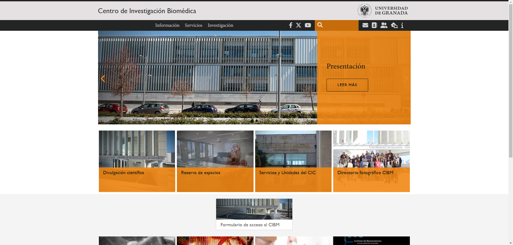
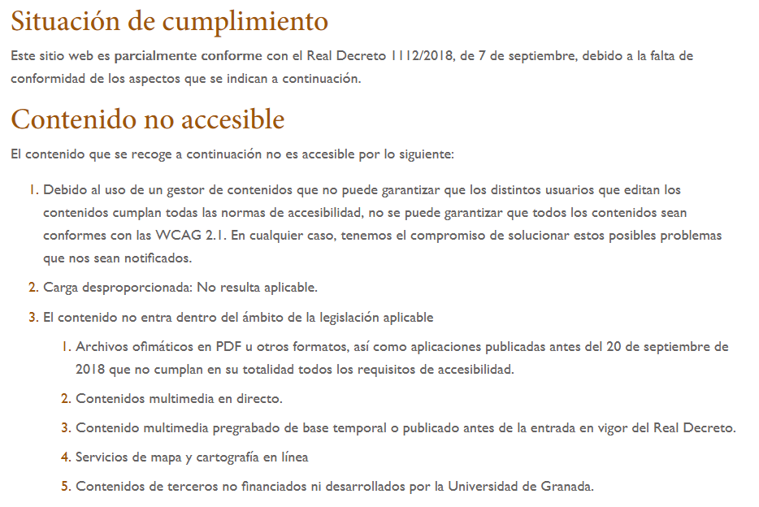
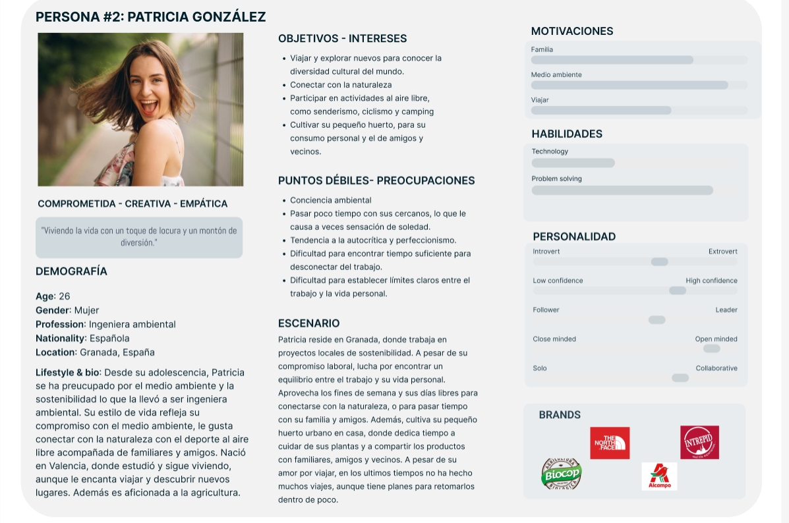
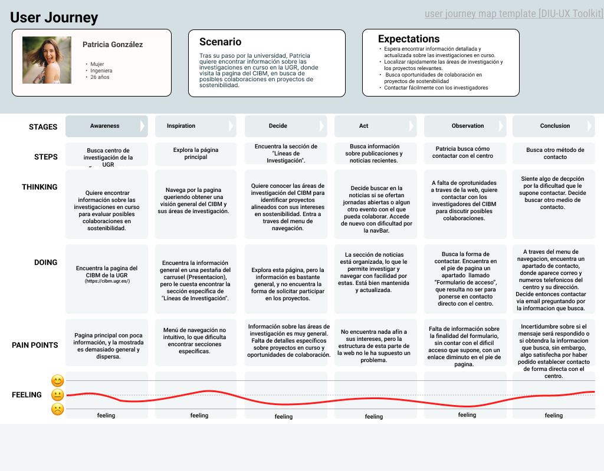
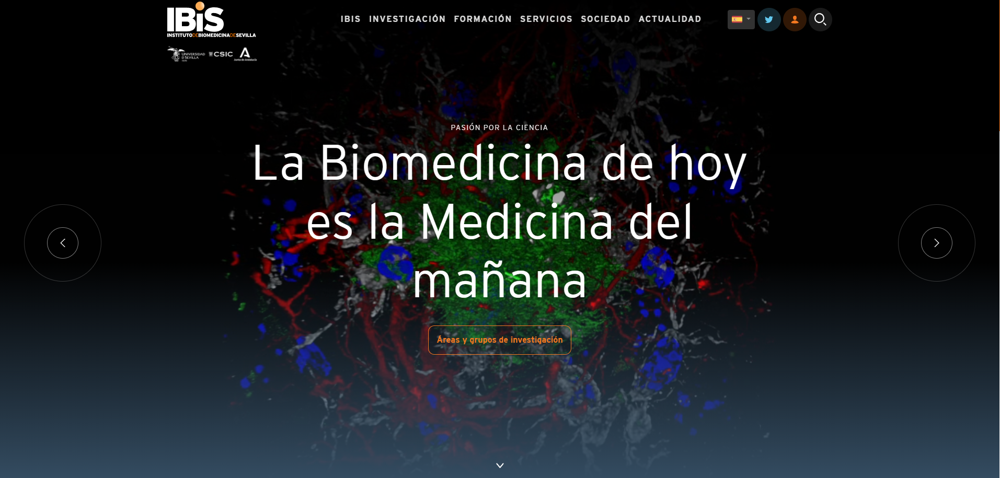

# Trabajo final DIU 2023/24
## Portfolio UX y resolución de un supuesto práctico
AUTOR: ÁLVARO LÓPEZ VERGARA
# PARTE I: MI EXPERIENCIA UX 

## Introducción
En esta primera parte del trabajo final, voy a tratar sobre mi experiencia en el diseño de interfaces de usuario (IU), experiencia de usuario (UX) y usabilidad, y los conocimientos adquiridos gracias a la asignatura de Diseño de Interfaces de Usuario. 

Durante el transcurso de la asignatura he realizado diversos ejercicios y actividades, por lo cuales, he adquirido conocimientos y me he puesto en puntos de vista que antes no habría visto sobre las interfaces de usuario. Tales como: la relaciones entre las personas y las máquinas/ordenadores, para comprender y resolver sus necesidades y dificultades; la creación, diseño y evaluación de interfaces y/o prototipos, con metodologías, técnicas y estrategias de diseño. Además, del diseño visual para interfaces tanto funcionales como estéticamente agradables, y usabilidad, con formas de medirla y mejorarla, destacando la accesibilidad como un punto importante.

A continuación, detallo mis aportaciones y experiencias, destacando su calidad y relevancia, mostrando cómo he aplicado los conceptos teóricos y metodologías prácticas que han enriquecido mi formación y me han preparado para enfrentar desafíos reales en el diseño de interfaces.

## Aportaciones en el Contexto de Ejercicios y Actividades de Clase

### Estudio Etnográfico 
Realizamos un pequeño estudio etnográfico, mediante el uso de una plantilla. Esta actividad, ayuda a comprender el contexto de uso, identificar problemas de usabilidad y proponer soluciones basadas en los principios estudiados en clase.
Te ayuda a observar y entender cómo los usuarios interactúan con los productos en casos reales, a ver los conflictos de interacción de una forma más analítica y detallada, pudiendo sacar conclusiones objetivas, detectando, incluso, problemas que los usuarios pueden no mencionar explícitamente cuando se les pregunta.

### Moodboard
Realizamos un moodboard sobre un proyecto imaginario, como una primera aproximación al diseño de una aplicación. Esta actividad, nos ayuda a definir y entender los puntos más importantes de la identidad visual de una aplicación, es una guía para el diseño inicial de la app en su conjunto.

### Accesibilidad
Realizamos un documento realizando una evaluación sobre la accesibilidad de una web. Esta actividad nos aporta un entendimiento profundo sobre la importancia de la accesibilidad web, tanto para personas con discapacidad como sin esta. Nos ayuda a identificar los problemas, mejorando nuestro punto de vista, para que nuestros futuros diseños tengan en cuenta estos requisitos de accesibilidad.

### Desarrollo Página Web creativa
Realizamos, mediante el uso de Figma, un presentación con efectos de animación. El objetivo de la actividad es aprender a usar Figma para crear efectos de animación en diseños web, inspirándose en tendencias actuales y personalizando nuestros proyectos para reflejar creatividad y funcionalidad.

## Aportaciones Destacables en Contexto de Prácticas
El proceso y desarrollo de las prácticas se ha dividido en cinco pasos, donde he ido aplicando los conocimientos vistos en clase de forma más práctica: 

- Investigación UX: Se ha realizado un análisis de usuarios, competidores, hemos usado técnicas de revisión de usabilidad para unas páginas propuestas y un mapa de empatía para comprender mejor las necesidades, pensamientos y sentimientos de los usuarios en su propia experiencia.

- Diseño UX: Se ha definido la propuesta de valor, realizado un análisis de tareas, desarrollado la arquitectura de la información, creado prototipos de baja y alta fidelidad, y definido las pautas de diseño.

- Moodboard y Landing Page: Aunque esta parte también pertenecería al diseño, la he separado por que considero que es ya parte de la aplicación del desarrollo anterior. Se ha diseñado un moodboard para definir la identidad visual de la aplicación y una landing page para presentar la propuesta de valor.

- Patrones de diseño y layout HI-FI: Se han utilizado los patrones de diseño de Material M3 de Google para garantizar una experiencia de usuario intuitiva y estética, aplicándolos en el diseño final realizado un layout HI-FI en Figma.

- Evaluación: Se ha realizado un test A/B y un cuestionario SUS para evaluar la usabilidad de las aplicaciones, y se ha identificado áreas de mejora.

### Aportes de cada actividad:

- Investigación UX: Estas actividades han sido fundamentales para comprender las necesidades y expectativas de los usuarios, pensando en abarcar tantos perfiles como sea posible, y para posteriormente definir la propuesta de valor de la aplicación a desarrollar, en base a la experiencia obtenida con la evaluación previa.

- Diseño UX: Estás actividades nos han permitido desarrollar una primera aproximación a la aplicación final, definiendo objetivos, necesidades…; analizando las tareas más importantes, organizando la lógica de la aplicación y diseñando un primer prototipo LO-FI.

- Moodboard y Landing Page: Estos elementos han sido importantes para comunicar la identidad visual de la aplicación y su propuesta de valor. Representamos los logos, tipografías, paleta de colores, eslogan…, todo con sus motivos de por qué su elección. En concreto, el moodboard sirve como guía para el diseño de la aplicación en su conjunto.

- Patrones de diseño y layout HI-FI: El uso de los patrones de diseño de Material M3 nos ha ayudado a garantizar una experiencia de usuario consistente y de alta calidad. Finalmente en el diseño HI-FI representamos todo lo expuesto en el diseño UX y nuestra propuesta de valor, siguiendo nuestros principios de identidad visual y estilo; es una representación de la interfaz final de la aplicación, en la que hemos aplicado todo lo anterior.

- Evaluación: Esta actividad nos ha permitido evaluar cuantitativamente el diseño y usabilidad de una aplicación mediante cuestionarios SUS y un A/B testing. Con estas técnicas, en definitiva podemos evaluar, aunque de forma inevitablemente subjetiva, de forma numérica, dando un valor concreto a la usabilidad. Además de identificar sus fortalezas y debilidades en UX y usabilidad

Destacar que en todo este proceso se ha empleado el uso de la herramienta Figma, con la he ido familiarizando y en la que he realizado gran parte de las tareas anteriores.

Enlace al repositorio de practicas, donde se encuentran las actividades: https://github.com/alvaro23LP/DIU.Alcaparra

## Otras aportaciones:

Además de las contribuciones ya comentadas, me gustaría comentar que los conocimientos de IU/UX/Usabilidad adquiridos también me han sido de utilidad en otros ámbitos y asignaturas. 
Así pues, en algunas asignaturas en las que he tenido que realizar alguna interfaz, he podido aplicar en gran medida los principios de UX y usabilidad, con la finalidad de crear la mejor interfaz posible cubriendo así las necesidades y expectativas de cada proyecto en cuestión.

## Conclusiones:
Tanto por las tareas realizadas en prácticas, como la teoría y ejercicios de la parte teórica de la asignatura, me han proporcionado una amplia gama de conocimientos y habilidades esenciales para el desarrollo de interfaces efectivas y centradas en el usuario. 

El haber realizado un caso propio, permitiendome aplicar conceptos teóricos y metodologías prácticas en un contexto “real”, con su propio diseño paso a paso, prototipos, evaluación, entre otras cosas; me han dado una nueva perspectiva a la hora de realizar y/o evaluar interfaces de usuario, pensando más en los usuarios, en un buen diseño basado en las necesidades concretas de cada situación y usuarios, en los principios de usabilidad, en la accesibilidad… 

En definitiva, aunque de manera bastante inicial, he aprendido a diseñar interfaces más inclusivas y funcionales, garantizando una experiencia de usuario óptima y satisfactoria. Esta experiencia integral me ha permitido desarrollar un enfoque más crítico y centrado en el usuario, lo que resulta indispensable para la creación de soluciones tecnológicas eficientes y accesibles; todo esto creo que queda reflejado y justificado tanto en las actividades realizadas, como en el resultado de las prácticas.

# PARTE II: CASO DE ESTUDIO

## Introducción
En esta segunda parte del trabajo final, vamos a realizar una evaluación de la página web de un centro de investigación de la Universidad de Granada (Centro de Investigación Biomédica de la Universidad de Granada), mediante un análisis de usabilidad y experiencia del usuario; para posteriormente compararla con un centro de investigación similar de otra universidad (Instituto de Biomedicina de Sevilla). 

#### Web del Centro de Investigación a analizar:
Centro de Investigación Biomédica (CIBM) de la UGR: [Web del CIBM](https://cibm.ugr.es/) 
 

## Análisis de la Página del CIBM
### Análisis del Diseño y Usabilidad
Vamos a comentar la página web del Centro de Investigación Biomédica de la Universidad de Granada, en concreto, sobre algunos aspectos positivos y negativos, proponiendo áreas de mejora en cuanto al diseño y la usabilidad. 

### Puntos positivos
En cuanto a estructura y contenidos, la página presenta se destaca por ser simple y profesional, con un diseño visual coherente con la temática. Tiene una estructura de navegación clara y bien organizada, con secciones y menús bien definidos jerárquicamente, facilitando la búsqueda de información dentro de ella a los usuarios. 

Además, mantiene la consistencia en el diseño a lo largo del sitio web y con otras páginas web de la Universidad de Granada, utilizando una estructura similar, variando simplemente en los contenidos concretos de cada web en específico. Esto da una sensación de identidad corporativa unificada y familiaridad, siendo muy gratificante a nivel de usuario, pues tiene la sensación de tener experiencia en la página si ya está familiarizado con otras de la misma institución.

Destacar que la página está adaptada para diferentes tamaños de pantalla, garantizando una experiencia consistente tanto para móviles y como computadoras; y que contiene cierto dinamismo e interactividad añadida, como por ejemplo el carrusel en la página principal.

### Puntos negativos
Podemos señalar la poca información que se presenta en la página inicial, que aunque es bueno que no esté sobrecargada, como ocurre a veces en webs institucionales, esta presenta muy poco contenido tanto en el menú de navegación, como en el completo de la página principal. 
También que el contenido no ocupa el ancho máximo en computadoras; este espacio podría aprovecharse para aumentar el tamaño de los contenidos y hacerlos más legibles y accesibles o para añadir esa información ausente.

La paleta de colores es adecuada, dando un tono algo sobrio y profesional, sin embargo una mayor variedad en la paleta de colores, para mejorar la legibilidad y contraste de algunos elementos, puede ser de utilidad para la mayor visibilidad de los mismos. 

La tipografía es correcta y efectiva con la identidad corporativa, pero los tamaños de letra son algo pequeños en algunas partes de la página, y esto no es bueno en términos de accesibilidad.

Hablando precisamente de la accesibilidad, lo único que nos encontramos es una pequeña referencia a accesibilidad en el pie de página, que nos lleva a una ventana en la se solo se nos notifica de que no se cumple con WCAG 2.1.  

Esto es un gran punto negativo, pues el carecer de distintas opciones de accesibilidad, tanto para personas discapacitadas, como personas que, aunque no sean, tengan dificultades tecnológicas, presenta barreras para consultar y acceder a la información y funcionalidades de esta página web.

### Propuestas de mejora
A continuación, se proponen unas posibles soluciones a los problemas vistos:
Para la falta de información, podría introducirse información genérica sobre el centro de investigación a modo de introducción para nuevos usuarios. 

Para el menú de navegación, hay varias posibilidades, una es la de incluir esta barra desplegable en la ya existente con los iconos de redes sociales, unificando los accesos en un único lugar; otra es la de incluir estos accesos en la pantalla inicial a modo de iconos destacados o similar. Esto mejoraría el acceso a estas zonas, siendo más intuitivo y accesible para todos los usuarios, evitando que estos no encuentren los que buscan cuando naveguen por la web.

Para las bandas laterales sin información, los ejemplos propuestos anteriormente, o hacer que el contenido se ajuste a este ancho, viéndose con mayor tamaño y aumentando su legibilidad, o aprovechar este espacio para añadir esa información inicial faltante.

El tema de los colores: podríamos mejorar el contraste de algunas zonas, añadiendo algo más de variedad, haciendo así algunos elementos más destacables y atractivos, para así, guiar al usuario por la página.
Por otro lado, el uso de imágenes y/o iconos/figuras para destacar información clave con el mismo objetivo de facilitar la comprensión de la información y el contexto de la navegación.

En cuanto al tamaño de la letra, debería de ser algo más grande en general, mejorando así la visibilidad y legibilidad para todo tipo de usuarios, en especial títulos, enlaces, y elementos clicables.

Finalmente en cuanto a accesibilidad, hay mucho por mejorar: la inclusión de texto descriptivo en las imágenes, opciones de ajuste de contraste y color, también para el tamaño del texto, algo de retroalimentación visual para las acciones en la web, indicadores de foco para navegación por teclado, y algunas opciones más. 
Aunque no sean obligatorias, si son de gran utilidad para algunas personas, e incluso necesarias; por tanto creo que se debería de mejorar este aspecto para garantizar que el sitio sea accesible para usuarios con discapacidades o necesidades especiales.

### Análisis de la Experiencia de Usuario
Tras el análisis anterior, he querido realizar pruebas simulando una experiencia real en un caso concreto, para ello voy a simular la experiencia de un usuario ficticio, con el fin de obtener mas información sobre la usabilidad, desde otro punto de vista, y asi tambien, mostrar los problemas que pueden presentarse a cualquier persona en un caso real.
Presentando la siguiente información sobre la persona:

Y su journey map en la web del CIBM:

Podemos concluir entonces que, el análisis de la experiencia de usuario de Patricia González en el sitio web del Centro de Investigación Biomédica de la UGR revela una serie de puntos de fricción que dificultan su navegación y búsqueda de información específica sobre oportunidades de colaboración en proyectos de sostenibilidad. 

Aunque Patricia puede encontrar información general y actualizada sobre el CIBM, la estructura y organización del sitio web presentan desafíos en la localización de detalles específicos sobre líneas de investigación y contactos directos con el personal. La poca intuitividad del menú de navegación y la ausencia de información clara sobre algunos campos concretos, agravan la frustración del usuario. 

Mejorar la intuitividad del menú de navegación, proporcionar información más detallada y específica, y facilitar el acceso directo a los datos de contacto y publicaciones, pueden ser mejoras cruciales para optimizar la experiencia de usuarios como Patricia, y mejorar la experiencia general de la web.

## Comparativa con la otro Centro de investigación similar
Web del Centro de Investigación similar:
Instituto de Biomedicina de Sevilla (IBiS): [Web del IBiS](https://www.ibis-sevilla.es/es/) 
 

Vamos ahora a comparar la página del centro de Investigación Biomédica de la UGR, con la del Instituto de Biomedicina de Sevilla, el cual también está enfocado a los mismos campos de investigación.
Para ello vamos a repasar semejanzas y diferencias en el diseño, señalando cual es la mejor en ciertos aspectos y cuál debería mejorar en otros cuantos.

### Similitudes
Las dos páginas presentan estructuras similares con un menú de navegación al que acceder a todos los apartados y una página principal con noticias destacadas o accesos directos.

Dentro de los distintos apartados, ambas mantienen una estructura y una consistencia claves para la sensación de unidad corporativa que quieren transmitir.
La tipografía también es consistente siendo simple y profesional, manteniéndose en toda la navegación de la página; no obstante en ambas es de pequeño tamaño en alguna partes siendo complicado la lectura del texto, e incluso en ocasiones el contraste es bajo, haciendo que ciertos usuarios no puedan o se les dificulte la comprensión de los contenidos.

Los dos diseños son responsive, se adaptan perfectamente a distintos tamaños de ventana e incluso a dispositivos móviles.

Ambas páginas presentan diferentes carencias en cuanto a accesibilidad. La primera, la del CIBM de la UGR, presentaba escasa información al respecto, y nulas opciones de accesibilidad; pero es que el IBIS, no da siquiera información en su página sobre el tema,  siendo este un punto muy negativo.

### Diferencias
En cuanto a la navegación, la página del IBIS presenta un notable mejor menú de navegación, con el uso de iconos y ciertas animaciones, dando una sensación de dinamismo, y sirviendo de guía al usuario.
La página de inicio además, también contiene una animación inicial en lugar de un carrusel, aportando a esa sensación de modernismo y siendo más visualmente atractiva. 

Por otro parte, la web del CIBM, carece de animaciones visuales tanto en la página principal como en el menú, lo que conlleva a una experiencia de usuario menos dinámica y gratificante.

En cuanto a la gama de colores, el IBIS presenta una mayor variedad, identificando cada sección del menú de navegación con uno distinto, y se apoya en imágenes para cada apartado de cada sección, haciéndolos más identificables que solo con texto plano.

### Conclusión de la comparación
Por los puntos anteriores podemos concluir, que la página del IBIS mejora en algunos aspectos a la del CIBM, sin embargo también tiene ciertos puntos a mejorar, como son la accesibilidad o la tipografía. Ambas páginas web son válidas, y plenamente funcionales en su contexto, cumpliendo con los objetivos que presentan de divulgación e información. Su usabilidad es buena y su diseño correcto.

## Conclusiones y auto-evaluación 
A modo de conclusión de este trabajo, pienso que he transmitido y aplicado mis conocimientos en los puntos anteriores, y creo que mi análisis y propuestas cumplen con los objetivos impuestos en la actividad., mejorando así, la estructura y diseño de la navegación, la legibilidad, el dinamismo y la accesibilidad para todo tipo de usuarios.

He usado los principios teóricos de  IU, UX y usabilidad para analizar y proponer mejoras en ambos casos, y creo que he realizado un trabajo, indiscutiblemente superior, al que habría realizado antes de conocer todos los conceptos y habilidades vistos durante todo el curso.

Añadir sobre *que hubiera sido interesante añadir a este caso de estudio*, decir que se podrían hacer análisis mucho más exhaustivos, desde un análisis de competitividad, una revisión mucho más específica de usabilidad…, y en especial, un test A/B el cual habría sido de gran utilidad en la comparación, dando valores numéricos, fácilmente comparables. Esto no lo he realizado por la magnitud de encuestas que habría que realizar para obtener unos resultados lo más verídicos y fiables posibles.

